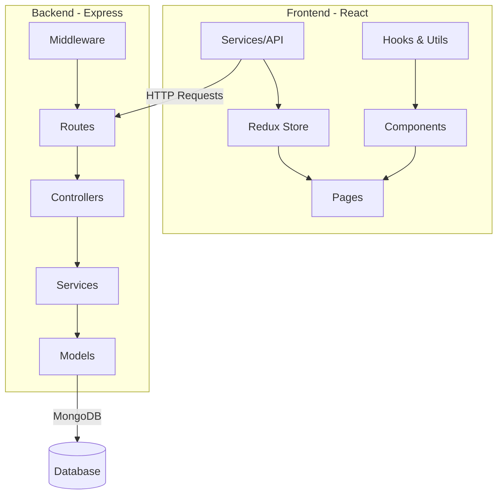
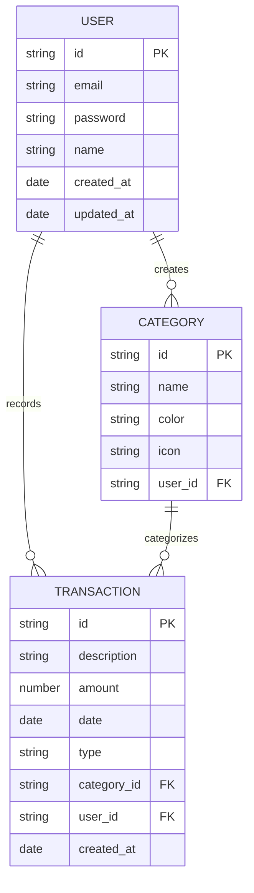
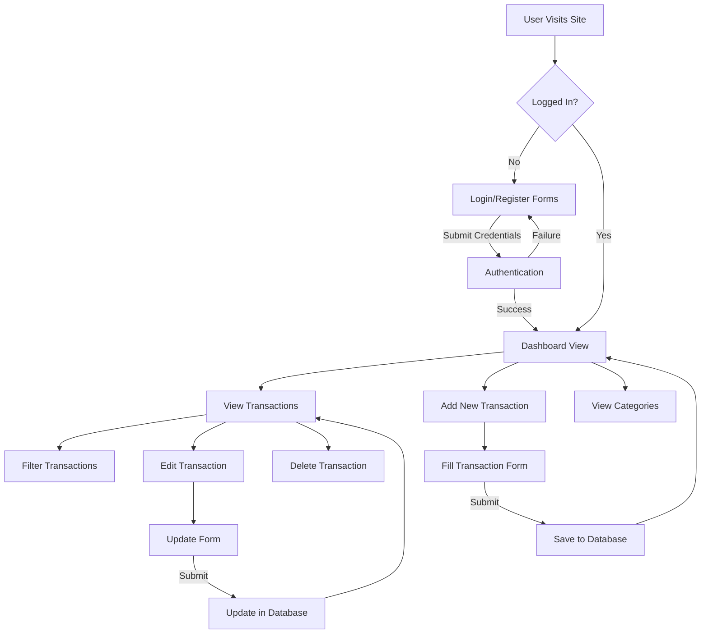

# Budget Tracker Implementation Plan

## Phase 1: Project Setup and Infrastructure

### 1.1 Project Structure and Configuration
- Set up the project structure (client/server folders)
- Configure package.json files (root, client, server)
- Set up environment variables and configuration
- Configure Git repository and .gitignore

### 1.2 Backend Foundation
- Set up Express server with basic middleware
- Configure MongoDB connection
- Create basic project structure for models, controllers, routes
- Set up error handling middleware

### 1.3 Frontend Foundation  
- Initialize React application
- Set up React Router for navigation
- Configure Redux store
- Create basic layouts and UI components
- Set up API service layer

## Phase 2: Core Authentication System

### 2.1 User Model and Authentication API
- Create User model with Mongoose
- Implement password hashing with bcrypt
- Create authentication controllers (register, login, get current user)
- Set up JWT token generation and validation
- Implement authentication middleware for protected routes

### 2.2 Frontend Authentication
- Create authentication forms (login, register)
- Set up Redux for authentication state
- Implement protected routes in React Router
- Create user profile page
- Add persistent login with token storage

## Phase 3: Basic Financial Management

### 3.1 Core Data Models
- Create Transaction model (for both income and expenses)
- Create Category model for expense categorization
- Implement validation for all models

### 3.2 Financial APIs
- Create CRUD API for transactions
- Implement filtering capabilities (by date, category, type)
- Create API for categories management
- Add summary endpoints for dashboard data

### 3.3 Transaction Management UI
- Create transaction list component with filtering
- Implement transaction creation/editing forms
- Add category management UI
- Create delete/edit functionality for transactions

## Phase 4: Dashboard and Visualization

### 4.1 Dashboard API
- Create API endpoints for dashboard summary data
- Implement data aggregation for visualizations
- Add date range filtering for dashboard data

### 4.2 Dashboard UI
- Create summary cards component (income, expenses, balance)
- Implement basic expense breakdown chart (pie chart)
- Add recent transactions list to dashboard
- Create responsive dashboard layout

## Phase 5: Deployment and Testing

### 5.1 Testing
- Write basic tests for critical API endpoints
- Add frontend component tests for authentication
- Test application flow end-to-end

### 5.2 Deployment Preparation
- Configure production settings
- Set up MongoDB Atlas for production
- Prepare deployment scripts

### 5.3 Deployment
- Deploy backend to hosting service (Heroku/Railway/etc.)
- Deploy frontend to hosting service (Netlify/Vercel/etc.)
- Configure environment variables in production

## Future Phases (After Core Functionality)

### Phase 6: Bill Management System
- Bill model and APIs
- Bill payment tracking and reminders
- Bill payment history

### Phase 7: Savings Goals
- Savings goal model and APIs
- Goal progress tracking
- Contribution management

### Phase 8: Advanced Reporting
- Extended analytics and reporting
- Data export capabilities
- Advanced visualizations

### Phase 9: Household Management
- Multi-user household features
- Shared expenses and income
- User permission system

## Technical Architecture Diagram

## Data Model Diagram

## User Flow Diagram

## Implementation Approach

1. **Iterative Development:** We'll implement features incrementally, focusing on completing vertical slices of functionality (front-end + back-end) for each core feature.

2. **API-First Design:** For each feature, we'll define and implement the API endpoints first, then connect the frontend.

3. **Component-Based UI:** We'll build reusable UI components that follow Material UI design patterns.

4. **Modern JavaScript:** We'll use ES6+ features and React hooks throughout the application.

5. **Testing Strategy:** We'll implement basic testing for critical paths and core functionality.